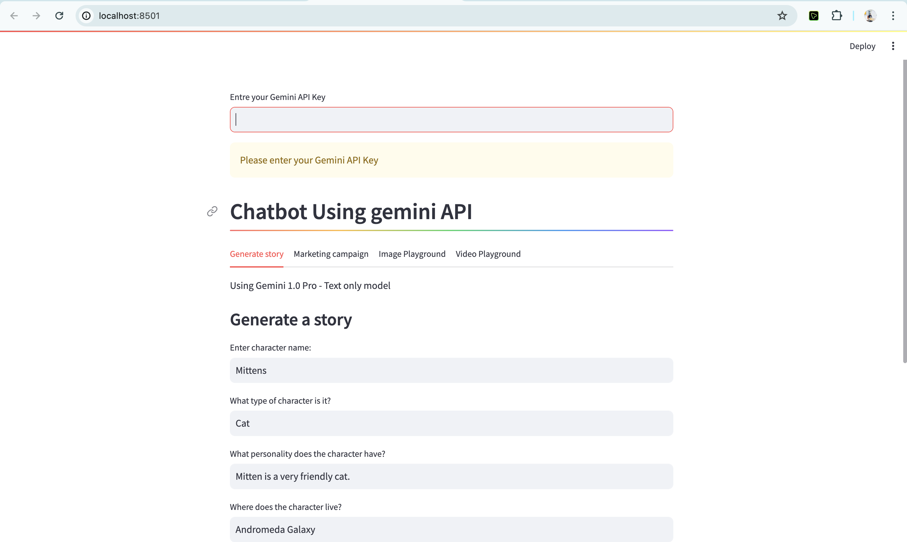

# Gemini Chatbot App



## Description
Gemini Chatbot is a versatile application built using the Gemini API. It offers four main features: story generation, marketing campaign assistance, and image and video playgrounds for creative projects.

## Installation
1. Clone the repository to your local machine.
2. Navigate to the project directory.
3. Set up a virtual environment (recommended).
   ```bash
   python3 -m venv venv
   ```
4. Activate the virtual environment.
   - On Windows:
     ```bash
     venv\Scripts\activate
     ```
   - On macOS and Linux:
     ```bash
     source venv/bin/activate
     ```


## Running the App
1. Make sure you have activated the virtual environment (if using one).
2. Run the Streamlit app.
   ```bash
   streamlit run main2.py
   ```

## Features
1. **Generate Story:** Create engaging stories using the Gemini API's story generation feature.
2. **Marketing Campaign:** Get assistance with your marketing campaigns, powered by Gemini's marketing tools.
3. **Image Playground:** Experiment with images for your projects, leveraging Gemini's image capabilities.
4. **Video Playground:** Explore video editing and creation with Gemini's video tools.

## Usage
- Upon running the app, you will be presented with a user interface where you can select the desired feature.
- Follow the on-screen instructions for each feature to utilize its functionalities.

## Support
For any issues or inquiries, please contact abuzar0013@gmail.com .

## License
This project is licensed under the [Your License] License - see the [LICENSE.md](LICENSE.md) file for details.

---

Feel free to customize this template to better suit your application's specific needs and details!